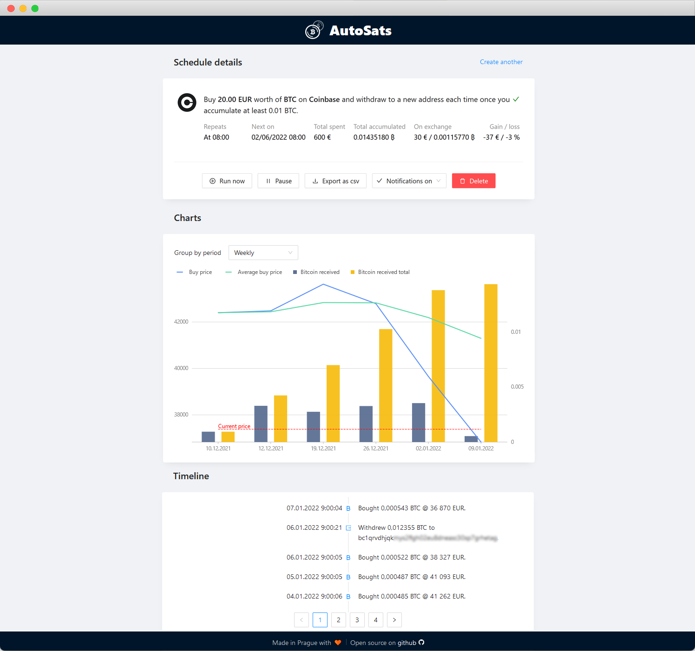

# AutoSats

[](https://github.com/bezysoftware/autosats/actions)


AutoSats is the simplest non-custodial DCA solution you can run on your own node. It lets you periodically buy Bitcoin on exchanges and withdraw it to your own wallet. 



## What is DCA?

> Dollar-cost averaging (DCA) is an investment strategy in which an investor divides up the total amount to be invested across periodic purchases of a target asset in an effort to reduce the impact of volatility on the overall purchase. The purchases occur regardless of the asset's price and at regular intervals.
[Source](https://www.investopedia.com/terms/d/dollarcostaveraging.asp).

## Supported exchanges

* Bitfinex
* Bitstamp
* Coibase PRO
* FTX
* Kraken
* Poloniex
* ...more coming in the future, see below how you can contribute

## Installation

AutoSats can be run in a Docker container. See how to [install docker](https://docs.docker.com/engine/install/).

Latest released version is available on [docker hub](https://hub.docker.com/repository/docker/bezysoftware/autosats/) and can be run like this:

```bash
docker run \
    -e Wallet__Bitcoind__Auth=<rpc_username:rpc_password> \
    -e Wallet__Bitcoind__Url="http://bitcoin:8332" \
    --network umbrel_main_network \
    -p 3311:80 \
    -v autosats:/app_data \
    -d \
    bezysoftware/autosats:latest
```

Let's go over the parameters:
* `-e` sets an enviromental variable, AutoSats needs to know where Bitcoind is running and its RPC credentials
* `--network` specifies the name of the Docker network that Bitcoind is running inside - you can ignore this if your Bitcoind isn't running inside a container
  * In that case you might want to set `-e Bitcoin__Url="http://host.docker.internal:8332"`
* `-p` exposes the inner port (80) to be available on an external port (3311) - the app will become available on this port (e.g. http://umbrel.local:3311) 
* `-v` mounts a volume on the host to persist data inside the container
* `-d` run the container in detached mode (your console won't be blocked)
* `bezysoftware/autosats:latest` is the name of the image, latest released version
  * You can set a fixed version (`:v0.0.1`)
  * Or you can use absolutely latest version `ghcr.io/bezysoftware/autosats:latest` (built from `main`) which is published to [Github Container Repository](https://github.com/bezysoftware/autosats/pkgs/container/autosats)

There is also an option to use a lightning wallet instead of Bitcoind wallet (this will be used in Umbrel):

```bash
docker run \
    -e Wallet__Type=lightning \
    -e Wallet__Lightning__ConnectionType=lndREST \
    -e Wallet__Lightning__BaseUri=<uri> \
    -e Wallet__Lightning__MacaroonFilePath=<path> \
    -e Wallet__Lightning__AllowInsecure=true \
    --network umbrel_main_network \
    -p 3311:80 \
    -v autosats:/app_data \
    -v /lnd:/lnd:ro \
    -d \
    bezysoftware/autosats:latest
```

The long term goal is to make AutoSats available on [Umbrel](https://github.com/getumbrel/umbrel/pull/1039) and similar solutions with one-click install.

## Contributing

AutoSats is in active development and help is certainly welcome. 
Currently it will be mostly needed to cover more exchanges. 
If you want to help to add your favorite exchange:

1) Make sure it's supported by [ExchangeSharp](https://github.com/jjxtra/ExchangeSharp/) (if not then first raise a PR there)
2) Test a schedule (including withdrawal) for your new exchange and create a PR. See this [sample Bitfinex PR](https://github.com/bezysoftware/autosats/pull/3)
3) Attach screenshots from the exchange history screen showing the purchase and withdrawal